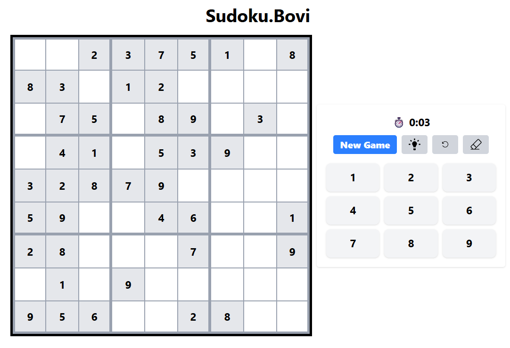
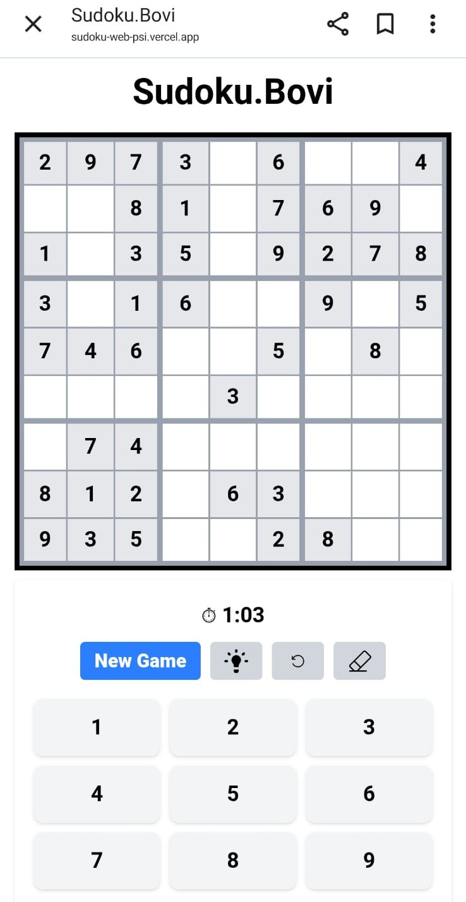

# 🧩 Sudoku.Bovi 😎


🎮 A modern, responsive **Sudoku Web App** built with **Next.js (App Router)**, **TypeScript**, and **Tailwind CSS**.  
Deployed on **Vercel** for fast and reliable performance. 

🔗 **Live Demo** → [sudoku-web-psi.vercel.app](https://sudoku-web-psi.vercel.app/)

---
## 📸 Preview
| Desktop View | Mobile View |
|--------------|-------------|
|  |  |

---
## ✨ Features
- 🎲 Interactive Sudoku board  
- ⌨️ Keyboard input (desktop)  
- 📱 On-screen number pad (mobile) — no keyboard popup  
- 🔄 Undo & Clear functionality  
- 💡 Hint options  
- ✅ Error highlighting  
- 🎨 Responsive design (fits full screen on both desktop & mobile)  

---

## 🚀 Getting Started Sudoku.Bovi in Local

### 1. Clone Repository
```bash
git clone https://github.com/BoviliusMeidi/sudoku-web.git
cd sudoku-web
```
### 2. Install Dependencies
```bash
npm install
# or
yarn install
```
### 3. Run Development Server
```bash
npm run dev
# or
yarn dev
```
### 4. Open in Browser
```bash
http://localhost:3000
```

---
## 📜 License
This project was built for portfolio and educational purposes.
Feel free to fork and modify it. Attribution is appreciated 🙌

---
## 👨‍💻 Author
Built by Me ➡️ [Bovilius Meidi](https://github.com/BoviliusMeidi) 😎
